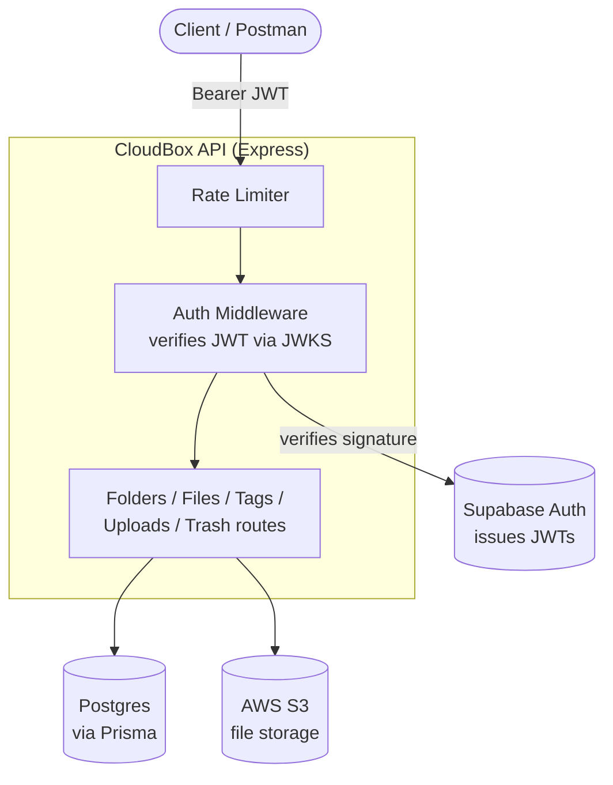
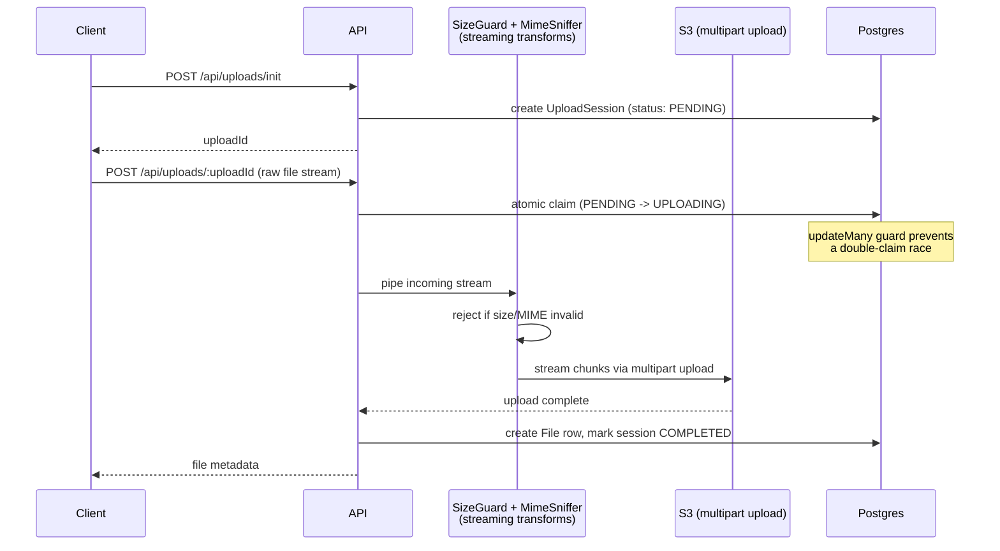

# CloudBox

A full-stack cloud storage service — think a stripped-down Google Drive/Dropbox clone — pairing a rigorously-tested Node/Express/Postgres API with a React/TypeScript client. Started as a backend-only project (see below for what that half demonstrates); the frontend was built on top of it afterward as a second, equally deliberate exercise.

**Live API:** <https://cloud-box-rsst.onrender.com> *(hosted on Render's free tier — the first request after a period of inactivity may take 30-60s to wake up)*
**Live app:** <https://cloud-box-0.onrender.com> — see [Trying the live app](#trying-the-live-app) below before you click it.

[](https://github.com/neterosaan/cloud-box/actions/workflows/tests.yml)

---

## Project structure

```
cloud-box/
  backend/     Express + Prisma + PostgreSQL + S3 API (the original project -- see below)
  frontend/    React + TypeScript + Vite + Tailwind client
```

---

## What the backend demonstrates

This isn't a CRUD tutorial project. A few things worth an interviewer's attention specifically:

- **True streaming uploads** — files are piped directly from the incoming HTTP request to S3 via multipart upload, with size limits and MIME-type validation (via magic-byte sniffing, not trusting the client's declared `Content-Type`) enforced *as data flows*, never buffering a whole file in memory.
- **Race-safe upload session claiming** — concurrent requests to the same upload session are resolved atomically at the database level (`updateMany` with a status guard), not with a read-then-write pattern that could double-process a session.
- **A trash/recycle-bin system with correct cascade behavior** — trashing a folder cascades to its contents, but an item trashed independently *before* its parent is protected from being swept up when the parent is later permanently deleted. This required moving away from relying on the database's own foreign-key cascade (which can't distinguish "safe to cascade" from "explicitly protected") toward an application-level design that tracks original locations separately, so restored items return to exactly where they were — matching how Google Drive and Dropbox behave.
- **A real automated test suite** — not just happy-path coverage. Includes concurrency tests (proving the race-safe claim actually holds under real concurrent requests against a real Postgres database), recursive CTE correctness tests, and several regression tests written *after* finding actual bugs during development (see [Notable bugs found & fixed](#notable-bugs-found--fixed-during-development) below).

---

## Architecture



### The upload pipeline

The most involved piece of the system — a file is streamed through several transforms before it ever fully lands in S3:



---

## Backend tech stack

- **Runtime:** Node.js 22, Express 5
- **Database:** PostgreSQL via Prisma ORM (hosted on Supabase)
- **Auth:** Supabase Auth (JWT verification via JWKS — this API never handles passwords or issues tokens itself)
- **Storage:** AWS S3 (streaming multipart uploads)
- **Validation:** Zod
- **Testing:** Vitest — unit tests for pure logic, integration tests against a real disposable Postgres container
- **CI:** GitHub Actions (runs the full test suite, including integration tests against a real Postgres service, on every push)
- **Logging:** Pino (structured application logs) + Morgan (HTTP access logs)
- **Containerization:** Docker (multi-stage build; see `backend/Dockerfile`)

## Frontend tech stack

- **Framework:** React 19 + TypeScript, built with Vite
- **Styling:** Tailwind CSS v4 (CSS-first `@theme` tokens — no `tailwind.config.js`), with a hand-rolled set of shadcn-style component primitives (Button, Dialog, AlertDialog, DropdownMenu, etc.) built directly on Radix UI, not the shadcn CLI
- **Routing:** React Router v7, with route-based code splitting (`React.lazy` + `Suspense`) so each page ships its own small chunk instead of one large bundle
- **Server state:** TanStack Query — every list, mutation, and cache invalidation goes through it; no hand-rolled loading/error state
- **Auth:** Supabase JS client, wired through a React Context that gates the protected route tree
- **Forms:** React Hook Form + Zod, with validation schemas that mirror the backend's own Zod rules exactly (same character limits, same regex) rather than being guessed independently
- **HTTP:** Axios (chosen specifically for its upload-progress events, which raw `fetch` doesn't expose)

---

## Frontend features

- Nested folder browsing with breadcrumb navigation, create/rename/move/delete
- Streaming file uploads with a real per-file progress bar, drag-and-drop, and an upload queue that survives navigating to a different page mid-upload
- Tagging: create/delete tags, attach/detach from files, filter search results by tag
- Search by name, file type, and tag, independently or combined
- Trash: restore or permanently delete, with correct handling of items that were only trashed as a side effect of a parent folder being deleted
- Responsive layout (collapsible sidebar drawer below desktop width) and labeled icon-only controls for screen readers

A few things worth calling out from actually building this against a real, already-written backend rather than one designed alongside the frontend:

- Several of the backend's endpoints don't follow its own general response envelope consistently (e.g. the two upload endpoints return their payload at the top level instead of nested under `data`; `updateFile`'s response is missing the `tags` array that every other file-returning endpoint includes; `restoreFile` returns the restored object while its sibling trash-restore endpoint only returns a message). The frontend's types and API layer are written to match what each endpoint *actually* returns, confirmed by reading the backend source directly rather than assumed from a pattern.
- Cache invalidation after mutations is based on the backend's actual behavior, not blanket "refresh everything": for example, permanently deleting an already-trashed file doesn't touch the storage-usage query, because a trashed file is already excluded from the quota sum — but restoring one does, since that's the moment it starts counting again.

---

## Features

| Feature       | Notes                                                                                                                               |
| ------------- | ----------------------------------------------------------------------------------------------------------------------------------- |
| Folders       | Nested folders, breadcrumb trails (recursive CTE), move with cycle detection                                                        |
| Files         | Upload, download (presigned URLs), rename, tagging                                                                                  |
| Tags          | Create/attach/detach, scoped per-user                                                                                               |
| Trash         | Soft delete, restore-to-original-location, cascading trash/restore, permanent delete, scheduled auto-purge after a retention window |
| Storage quota | Per-user upload quota enforced *during* the stream, not after the fact                                                              |
| Pagination    | Cursor-independent page/limit pagination on listing endpoints                                                                       |
| Rate limiting | Global IP-based limit + a stricter per-user limit specifically on upload routes                                                     |

---

## API reference

A full **Postman collection** covering every endpoint (with a pre-request script to auto-fetch a test JWT from Supabase) is included: [`backend/cloudbox.postman_collection.json`](https://github.com/Ahmed-Amer02/cloud-box/blob/main/backend/cloudbox.postman_collection.json).

Import it, set the `baseUrl` variable, and run the "Get Test Token" request first to populate `authToken` for the rest of the collection.

**Interactive API docs (Swagger UI):** <https://cloud-box-rsst.onrender.com/api-docs>

Browse and try every endpoint directly in the browser — no tool install required. The Postman collection above is still the better choice for actually developing against the API (it includes the auto-token-fetch script and saved environments); Swagger is the fastest way for someone reviewing the project to see what it does.

---

## Trying the live app

The frontend and backend are two separate deployments, and the backend sleeps after 15 minutes of inactivity (Render's free tier) — so the first load will fail if you skip step 1:

1. Open <https://cloud-box-rsst.onrender.com> directly in a tab first, and wait for the `{"status":"ok",...}` response. If it's been asleep, this can take 30-60 seconds — that's the backend waking up, not an error.
2. Once that responds, open the frontend: <https://cloud-box-0.onrender.com>
3. Sign up (or log in), and try creating a folder, uploading a file, tagging it, searching for it, and trashing/restoring it.

If the frontend still shows a loading or connection error after step 1 succeeded, the backend has likely gone back to sleep in between — just repeat step 1.

---

## Running locally

**Requirements:** Node 22+, Docker (for the test database), a Supabase project, an AWS S3 bucket.

```
git clone https://github.com/Ahmed-Amer02/cloud-box.git
cd cloud-box/backend
npm install
```

Create a `.env` file inside `backend/` with:

```
DATABASE_URL=
DIRECT_URL=
SUPABASE_URL=
AWS_REGION=
AWS_ACCESS_KEY_ID=
AWS_SECRET_ACCESS_KEY=
AWS_BUCKET_NAME=
FRONTEND_URL=       # optional -- CORS origin, defaults to http://localhost:5173 if unset
```

```
npx prisma migrate deploy
npm run dev
```

### Running with Docker

```
cd backend
docker build -t cloud-box .
docker run --env-file .env -p 3000:3000 cloud-box
```

### Running the tests

```
cd backend
npm run test:unit          # pure logic, no external dependencies

npm run test:db:up         # starts a disposable Postgres container
npm run test:db:migrate
npm run test:integration   # race conditions, recursive CTEs, cascade behavior
```

### Running the frontend

```
cd frontend
npm install
cp .env.example .env
```

Fill in `.env`:

```
VITE_API_BASE_URL=http://localhost:3000/api
VITE_SUPABASE_URL=            # same Supabase project as the backend
VITE_SUPABASE_ANON_KEY=       # Project Settings -> API, in your Supabase dashboard
```

```
npm run dev
```

The backend's CORS is scoped to `FRONTEND_URL` (defaults to `http://localhost:5173`), so running both locally at their default ports works with no extra configuration.

---

## Notable bugs found & fixed during development

Kept here deliberately, rather than a spotless-looking commit history — these were caught by the test suite during development, not left as silent issues:

- A case-sensitive filename mismatch (`uploadCleanupJob.js` vs. `uploadCleanupjob.js`) that worked locally on Windows but crashed on Linux deployment — caught by the difference between a case-insensitive and case-sensitive filesystem.
- `createFolder` allowed nesting a new active folder under an already-trashed one, which combined with the database's own foreign-key cascade could have caused an active folder to be silently, permanently deleted when its trashed ancestor was purged. Fixed by redesigning the trash system to detach items from the live folder tree at the moment they're independently trashed, rather than relying on the database's cascade to sort out what's "safe."
- A pagination helper used `parsedLimit || DEFAULT` to fall back on invalid input — which incorrectly treated an explicit `limit=0` the same as "not provided," since `0` is falsy in JavaScript, silently ignoring a user's valid request to clamp their own page size.
- The trash feature's routes existed and were fully tested at the service layer, but were never actually mounted in `app.js` — invisible to every unit and service-level test, and only caught by a route-level smoke test hitting the real HTTP layer.

---

## Known limitations

### Backend

- The in-memory rate limiter store means limits reset if the process restarts, and wouldn't hold correctly across multiple horizontally-scaled instances (not a concern at the current single-instance deployment scale).

### Frontend

- No automated end-to-end/browser test suite yet — verification so far has been manual, against the real deployed backend.
- Code splitting is route-based only; the shared vendor bundle (React, Radix, TanStack Query, Supabase client, etc.) isn't further split, though it's cached once per visitor rather than re-fetched per page.
- Responsive layout and icon-button labeling have been reviewed, but there's been no full audit with actual assistive technology (screen readers, etc.) beyond spot-checks.
